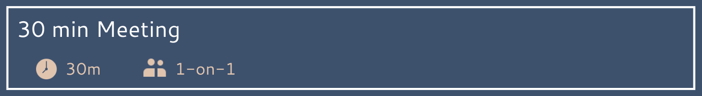

 
I'm Alex, a dev trainer, here to improve my coding skills, 
I love to tinker with anything, IRL and IVL . 
Feel free to judge and review !
 
 

  <a>   
    &nbsp;
    &nbsp;
   &nbsp;
   &nbsp;
       &nbsp;
   &nbsp;
   &nbsp;
     &nbsp;
   &nbsp;
    &nbsp; 
     
      &nbsp;
     &nbsp;
     &nbsp;
    &nbsp;
       &nbsp;
   &nbsp;
   &nbsp;
   &nbsp;
 &nbsp;
  </a>
    

 
You can contact me about anything and everything ! 

I will, for sure, take time to answer to you :

 

  &nbsp;&nbsp;&nbsp;&nbsp;
      &nbsp;&nbsp;&nbsp;&nbsp;
  &nbsp;&nbsp;&nbsp;&nbsp;
    &nbsp;&nbsp;&nbsp;&nbsp;
 
 

 
Click on the box below, and pick a slot if you'd like to chat about anything you are into !

We could talk about Sci-fi books, interior design, indoor plants...   
Or even coding !    
&nbsp;&nbsp;&nbsp;
 &nbsp;
 

<h2 align="center">

  
</h2>
  

<picture>
  <source
    srcset="https://github-readme-stats.vercel.app/api?username=AlexEnCode&show_icons=true&theme=dark&hide_border=true"
    media="(prefers-color-scheme: dark)"
  />
  <source
    srcset="https://github-readme-stats.vercel.app/api?username=AlexEnCode&show_icons=true&bg_color=3D516D&title_color=E0C4AE&text_color=ffffff&icon_color=E0C4AE"
    media="(prefers-color-scheme: light), (prefers-color-scheme: no-preference)"
  />
  
</picture>

<a>

